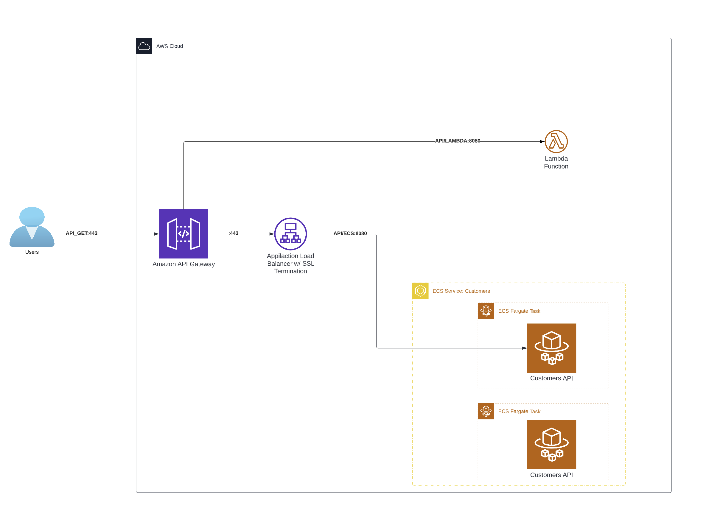
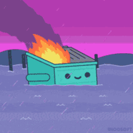

# DUCKS (Dynamic API for Unleashing Cloud KubeFlow Stability)
## _A walkthrough on creating ephemeral AI, GPU driven APIs in the Cloud_

//IMAGE TO BE CREATED UPON COMPLETION


### MVP: Minimal Viable Product

An API call should spin up the approrpiate amount of GPU compute for the single call and return an image, or a pointer to an image in S3.

You should be able to query the available models that are available (stored in S3) and include that in the API call.

# Walkthrough

Through this walkthrough, there will be use of some [DevOps Terminology](#devops-terminology) (this's a local link to the help).

Our goal is to deploy [KubeFlow](#kubeflow) onto different cloud providers to create ephemeral environments per API call with [serverless](#serverless) best practices in mind.

First we'll do it in our local environment:

## Deploy Locally

### Tech Stack (install these)


- [Python 3.10+](https://www.python.org/downloads/): Logic/Code layer
- [Docker](#docker): [Containerization](#container) layer
- [MiniKube](https://minikube.sigs.k8s.io/docs/): Local [Kubernetes](#kubernetes) Cluster
- [Kubectl](https://kubernetes.io/docs/reference/kubectl/): [Kubernetes](#kubernetes) Command Line (CLI) Tool
- [KIND](https://kind.sigs.k8s.io): run local [Kubernetes](#kubernetes) cluster
- [KServe](#kserve): You must install these tools:
> If you start from scratch, KServe requires Kubernetes 1.17+, Knative 0.19+, Istio 1.9+.

    - go: KServe controller is written in Go and requires Go 1.18.0+.
    - git: For source control.
    - Go Module: Go's new dependency management system.
    - ko: For development.
    - kubectl: For managing development environments.
    - kustomize To customize YAMLs for different environments, requires v3.5.4+.
    - yq yq is used in the project makefiles to parse and display YAML output requires yq 4.*.

## HOW R HAXOR!?


Create a local Kubernetes environment with:

```shell
kind create cluster --name=local-kserve
``` 

Now that we've created a new cluster locally in Docker, we should be able to see it with:
```shell
cat ~/.kube/config
```

This should return something like:
```shell
Creating cluster "local-kserve" ...
 • Ensuring node image (kindest/node:v1.27.3) 🖼  ...
 ✓ Ensuring node image (kindest/node:v1.27.3) 🖼
 • Preparing nodes 📦   ...
 ✓ Preparing nodes 📦 
 • Writing configuration 📜  ...
 ✓ Writing configuration 📜
 • Starting control-plane 🕹️  ...
 ✓ Starting control-plane 🕹️
 • Installing CNI 🔌  ...
 ✓ Installing CNI 🔌
 • Installing StorageClass 💾  ...
 ✓ Installing StorageClass 💾
Set kubectl context to "kind-local-kserve"
You can now use your cluster with:

kubectl cluster-info --context kind-local-kserve

Have a question, bug, or feature request? Let us know! https://kind.sigs.k8s.io/#community 🙂
```

To confirm you have the correct context, run:
```shell
kubectl config get-contexts
```
This should return something like:

```shell
CURRENT   NAME                CLUSTER             AUTHINFO                     NAMESPACE
*         kind-local-kserve   kind-local-kserve   kind-local-kserve
```

Now that we have a context referencing our local cluster, we need a namespace:
```shell
kubectl create namespace kserve-test
```

Clone this repo and run 


## Clouds
These DUCKS should be able to fly in any cloud. We'll start with [CoreWeave](https://www.coreweave.com).


We've only ever flown in AWS so for now, this is the "North Star" to guide the flight. New diagram to come.



## DevOps Terminology

### Container

Think of a container like a shipping container for software. Docker is a company that makes standardized shipping containers. As a shipping container can be deployed on a train, truck, or boat because of it's standardization; in software, a container can be deployed on localhost, AWS, or CoreWeave just as easily and is operating system independent. It's effectively a virtualization layer that's extremely portable.

### Docker

[Docker](https://www.docker.com) is to containers as Kleenex of tissue paper. They're the first containerization platform you think of and, as such, have cornered the market. They've recently become less Open Source minded. So I hope to eventually move most of my projects to [Open Container Initiative](https://opencontainers.org)

### Kubernetes

[Kubernetes](https://kubernetes.io/docs/concepts/overview/), also known as K8s, is an open-source system for automating deployment, scaling, and management of containerized applications.

### KServe

[KServe](https://github.com/kserve/kserve) provides a Kubernetes Custom Resource Definition for serving machine learning (ML) models on arbitrary frameworks. It aims to solve production model serving use cases by providing performant, high abstraction interfaces for common ML frameworks like Tensorflow, XGBoost, ScikitLearn, PyTorch, and ONNX.

It encapsulates the complexity of autoscaling, networking, health checking, and server configuration to bring cutting edge serving features like GPU Autoscaling, Scale to Zero, and Canary Rollouts to your ML deployments. It enables a simple, pluggable, and complete story for Production ML Serving including prediction, pre-processing, post-processing and explainability. KServe is being used across various organizations.

### KubeFlow

The [KubeFlow](https://www.kubeflow.org) project is dedicated to making deployments of machine learning (ML) workflows on Kubernetes simple, portable and scalable. Our goal is not to recreate other services, but to provide a straightforward way to deploy best-of-breed open-source systems for ML to diverse infrastructures. Anywhere you are running Kubernetes, you should be able to run Kubeflow.

### Serverless

- Serverless doesn't mean there are no servers. It means the complexity of server management and capacity planning is abstracted away from developers.
- It's synonymous with auto-scaling to the extent that serverless solutions can scale from handling zero requests (hence, no cost) to handling thousands or millions, based on demand.
- The beauty of serverless is its economic model: when there's no traffic, there's no cost.


------

## Brain Dump (Wants)


- S3 Front End
- CloudFront
- Website


## Backlog

- Discord Bot
- Twitch Bot

---


## References Credited
- [DagsHub: How To Install Kubeflow Locally](https://dagshub.com/blog/how-to-install-kubeflow-locally/)
- [KubeFlow](https://www.kubeflow.org)
